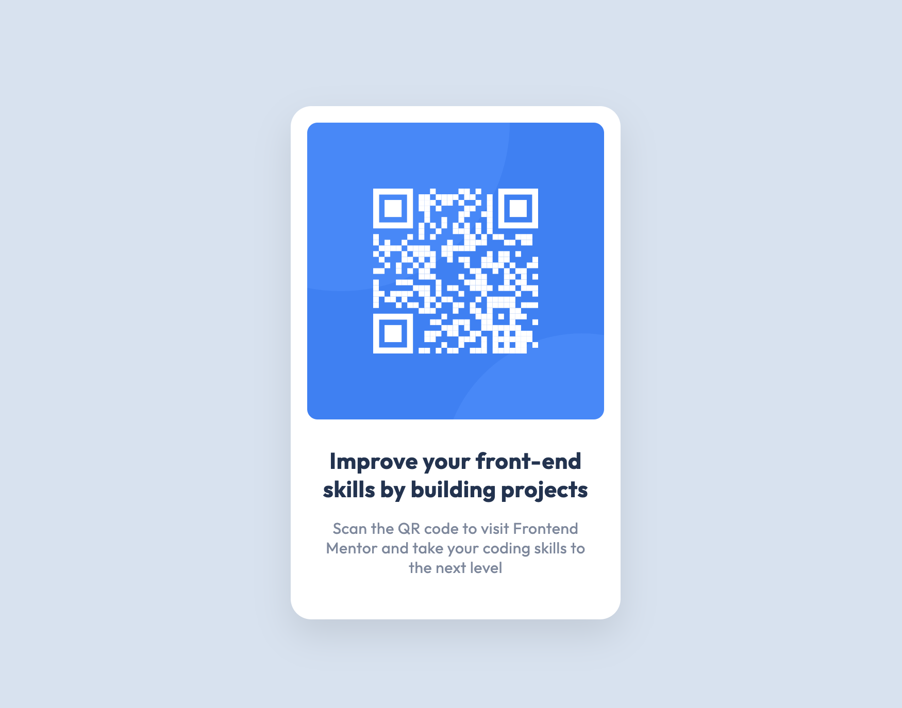

# Frontend Mentor - QR code component solution

This is a solution to the [QR code component challenge on Frontend Mentor](https://www.frontendmentor.io/challenges/qr-code-component-iux_sIO_H). Frontend Mentor challenges help you improve your coding skills by building realistic projects. 

## Table of contents

- [Overview](#overview)
  - [Screenshot](#screenshot)
  - [Links](#links)
- [My process](#my-process)
  - [Built with](#built-with)
  - [What I learned](#what-i-learned)
  - [TODO](#TODO)
  - [Useful resources](#useful-resources)
- [Author](#author)

## Overview

### Screenshot



### Links

- [Solution URL](https://github.com/MawsFr/fm-qr-code-component)
- Live Site URL: [Add live site URL here](https://your-live-site-url.com)

## My process

### Built with

- Semantic HTML5 markup
- CSS custom properties
- Flexbox

### What I learned

I've learned that I can use the `gap` property to add a margin that is effective in all directions reguarding the `flex-direction` !

```css
.card {
  display: flex;
  flex-direction: column; /* Try change this */
  align-items: center;
  gap: 24px; /* Will be present in all flex-direction */
  ...
}
```

### TODO

Learn more about :

* SCSS
* em / rem
* media queries
* Tailwind CSS
* BEM

### Useful resources

- [Flexbox Zombie](mastery.games/flexboxzombies) - This game made me practice Flexbox a lot.
- [Flexbox froggy](https://flexboxfroggy.com/) - Another game to learn Flexbox.
- [Learn Flexbox the easy way](https://www.youtube.com/watch?v=u044iM9xsWU) - A video that gave me a good understanding of flexbox.

## Author

- Website - [Mustapha NEZZARI](https://mawsfr.github.io/)
- Frontend Mentor - [@MawsFr](https://www.frontendmentor.io/profile/MawsFr)
- Twitter - [@mustaphanezzari](https://twitter.com/mustaphanezzari)
